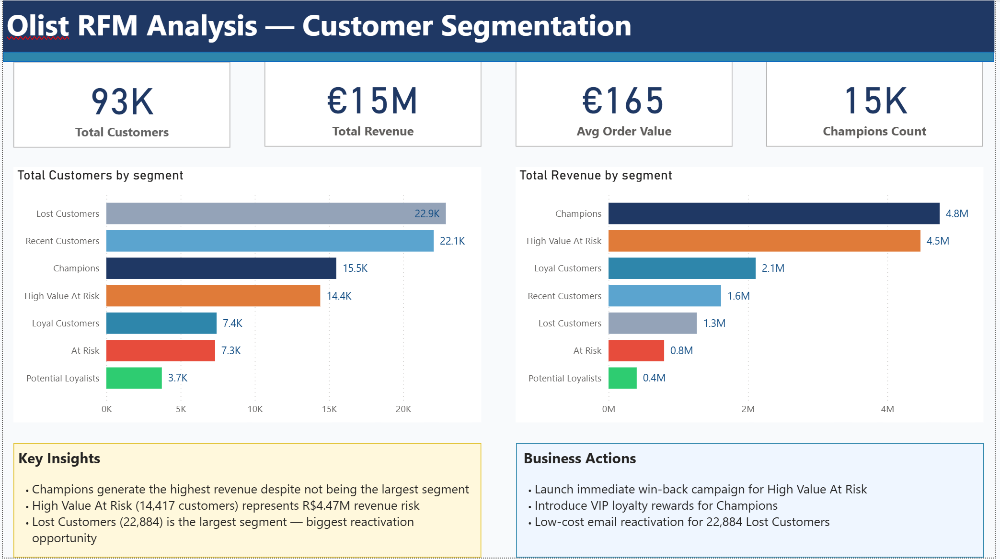
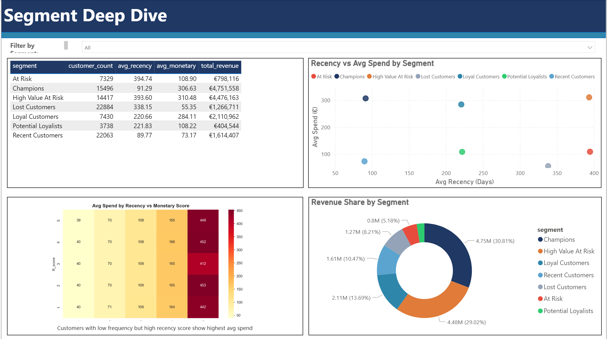
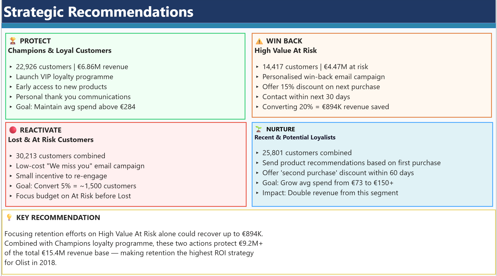

# Olist-RFM-Customer-Segmentation
RFM customer segmentation analysis using PostgreSQL, Python and Power BI

---
# Olist RFM Analysis — Customer Segmentation

End-to-end customer segmentation analysis of the **Olist Brazilian E-Commerce dataset** using RFM (Recency, Frequency, Monetary) methodology. 
The analysis identifies 7 distinct customer segments across 93,357 customers and delivers data-backed retention strategies worth over €1.5M in recoverable revenue.

---

## 📋 Project Overview

| | |
|---|---|
| **Dataset** | [Olist Brazilian E-Commerce — Kaggle](https://www.kaggle.com/datasets/olistbr/brazilian-ecommerce) |
| **Tools** | PostgreSQL · Python · Power BI |
| **Analysis Type** | RFM Customer Segmentation |
| **Customers Analysed** | 93,357 |
| **Total Revenue** | €15.4M |

---

## 🎯 Business Objective

Three key questions this analysis answers:
- **Who are the most valuable customers** and how can the business protect that revenue?
- **Which customers are at risk of leaving** and what is the financial impact?
- **What targeted actions** should the business take for each segment to maximise ROI?

---

## 🔑 Key Findings

| Segment | Customers | Avg Spend | Total Revenue | % of Revenue |
|---|---|---|---|---|
| Champions | 15,496 | €306.63 | €4,751,558 | 30.8% |
| High Value At Risk | 14,417 | €310.48 | €4,476,163 | 29.0% |
| Loyal Customers | 7,430 | €284.11 | €2,110,962 | 13.7% |
| Recent Customers | 22,063 | €73.17 | €1,614,407 | 10.5% |
| Lost Customers | 22,884 | €55.35 | €1,266,711 | 8.2% |
| At Risk | 7,329 | €108.90 | €798,116 | 5.2% |
| Potential Loyalists | 3,738 | €108.22 | €404,544 | 2.6% |

**Critical insight:** High Value At Risk customers (14,417 people × €310 avg spend) represent **€4.47M in revenue risk**. A win-back campaign converting just 20% could recover **€894K**.

---

## 💡 Strategic Recommendations

| Priority | Segment | Action | Expected Impact |
|---|---|---|---|
| 🏆 PROTECT | Champions & Loyal | VIP loyalty programme | Protects €6.86M |
| ⚠️ WIN BACK | High Value At Risk | 15% discount win-back email | Recover €894K |
| 🔴 REACTIVATE | Lost & At Risk | "We miss you" campaign | ~1,500 customers back |
| 🌱 NURTURE | Recent & Potential | Second purchase incentive | Double segment revenue |

---

## 📸 Dashboard

### Page 1 — Customer Segmentation Overview

### Page 2 — Segment Deep Dive

### Page 3 — Strategic Recommendations

---

## 🛠️ Tools & Methodology

### PostgreSQL
- Created and loaded 3 tables: `customers`, `orders`, `order_payments`
- Wrote KPI queries: total revenue, AOV, revenue by state
- Calculated RFM metrics using `MAX()`, `COUNT(DISTINCT)`, `SUM()` with CTE structure
- Used dataset max date (2018-08-29) as reference point to avoid recency distortion

### Python (Jupyter Notebook)
- Loaded `rfm_data.csv` — 93,357 rows, 0 nulls
- Scored R, F, M on a 1–5 scale using `pd.qcut()`
- **Key adaptation:** Segmentation logic uses R + M (not R + F) because 95%+ of Olist customers have frequency = 1, typical of a marketplace platform
- Generated segment visualisations and heatmap
- Exported `rfm_segments_final.csv` for Power BI

### Power BI
- Built 3-page interactive dashboard with dropdown segment slicer
- DAX measures for dynamic KPI cards
- Consistent 7-colour segment palette across all visuals
- Consulting-style Key Insights + Business Actions on each page

---

## 👤 Author

**Ilham Oussanna** — Junior Data Analyst   
🔗 [LinkedIn](https://www.linkedin.com/in/ilham-o-89372a274)

---

*Dataset source: [Olist Brazilian E-Commerce on Kaggle](https://www.kaggle.com/datasets/olistbr/brazilian-ecommerce)*

